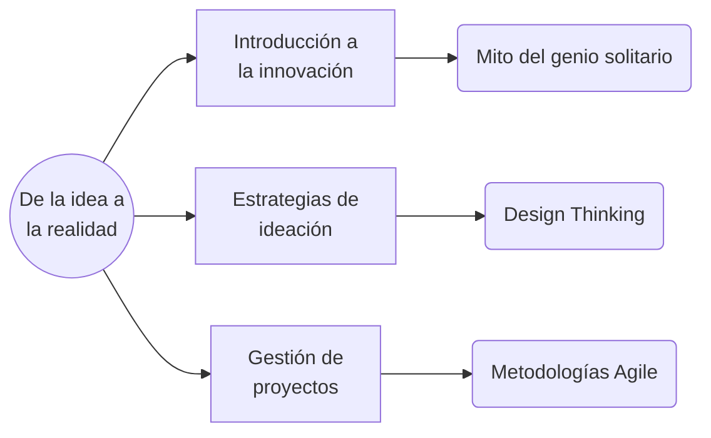

# Mi Mapa Conceptual de Prueba

```mermaid
graph LR
    A((De la idea a<br/>la realidad)) --> B[Introducción a<br/>la innovación]
    A --> C[Estrategias de<br/>ideación]
    A --> D[Gestión de<br/>proyectos]
    
    B --> B1(Mito del genio solitario)
    C --> C1(Design Thinking)
    D --> D1(Metodologías Agile)
```

